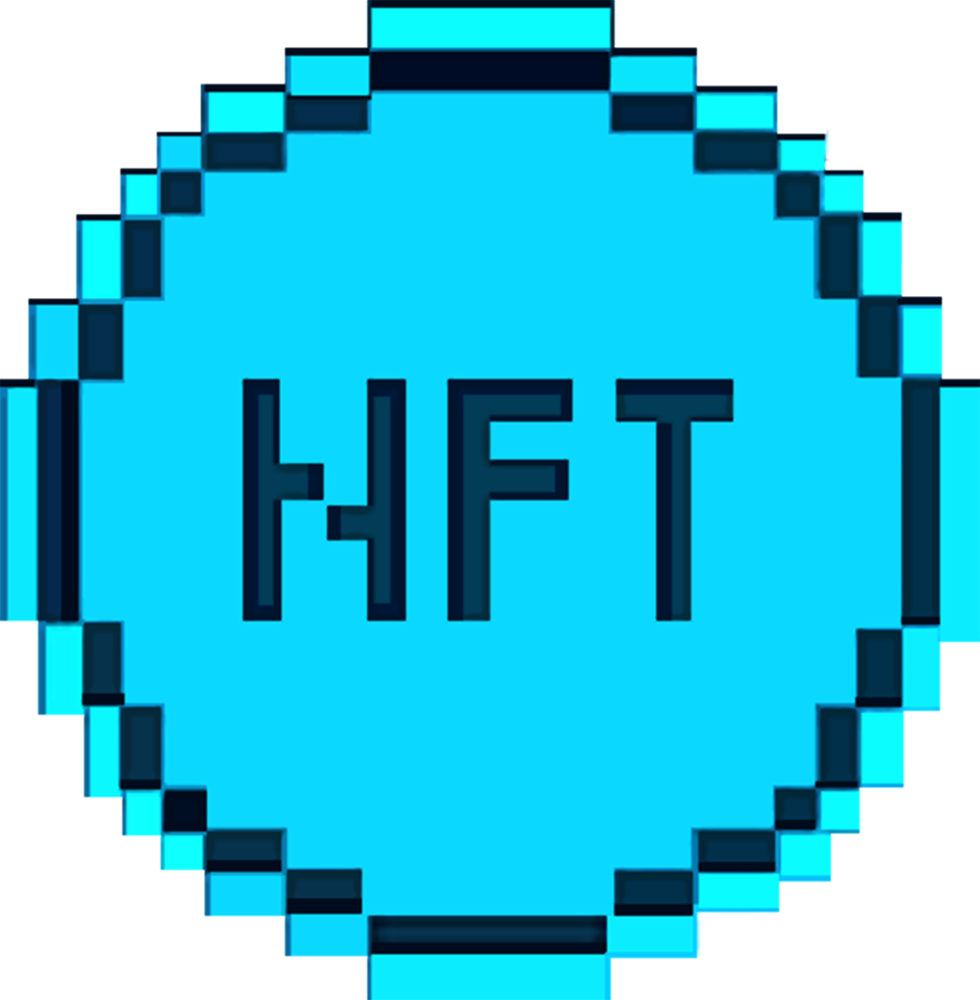

# 🏢 DAO

The Hex Pixel DAO is a decentralized autonomous organization that acts as the Hex Pixel community's governing body. The primary DAO is made up of a core governing council known as the "Gorilla League," which makes decisions on community membership and proposal execution. The "Pixel Group" subdao is dedicated to encouraging community participation and involvement, including establishing incentive mechanisms for individuals who stake their tokens and are actively involved in the game's design and promotion. Finally, the "Pixel Tokenization" subdao is in charge of administering the Pixel Token ($PIX) and producing DAO-specific NFTs. Its decentralized framework ensures that Hex Pixel's gaming ecosystem choices are determined by the community and fosters openness and responsibility.

<figure><figcaption></figcaption></figure>

### [Hex Pixel (main)](https://daodao.zone/dao/juno12clyhx5qf2e079xyxkrn8kqzz0kq8urzrgxcylau00qzeg6lw9hsjh4pmp#proposals)

The main DAO Hex Pixel plays a crucial role in the success and growth of the Hex Pixel gaming community. Its primary purpose is to make important decisions and provide the necessary resources and budget for the development, marketing, and community engagement of the game. Here are the key responsibilities of the main DAO Hex Pixel:

1. Allocating resources and budget: The main DAO Hex Pixel has the power to propose and decide on the allocation of resources and budget for the various aspects of the game. This includes development, marketing, and community engagement activities. The DAO will consider the current financial state of the game and the needs of the community when deciding on the budget.
2. Partnerships and collaborations: The main DAO Hex Pixel is responsible for deciding on partnerships and collaborations with other companies and platforms. This is an important aspect of the game's growth, as partnerships can help increase the visibility and reach of the game. The DAO will consider the reputation, reliability, and compatibility of the potential partners before making a decision.
3. Economic model and revenue distribution: The main DAO Hex Pixel is responsible for deciding on the game's economic model and revenue distribution. This includes decisions on the pricing of in-game items, the distribution of profits, and the creation of new revenue streams. The DAO will take into account the needs of the community, the game's financial state, and the overall vision of the game.
4. Security protocols: The main DAO Hex Pixel is responsible for addressing any security concerns and implementing necessary protocols to ensure the safety and security of the game and its players. This includes implementing encryption and authentication protocols, monitoring the game's performance and security, and responding to any security incidents.
5. New member requests: The main DAO Hex Pixel is responsible for approving new member requests and granting access to the community resources. This includes granting access to the forums, community resources, and other benefits. The DAO will consider the reputation and reliability of the potential members before making a decision.

In addition to these responsibilities, the main DAO Hex Pixel will also play an important role in the growth and development of the gaming community. By providing the necessary resources, making important decisions, and ensuring the security and stability of the game, the main DAO Hex Pixel will help create a thriving and engaging gaming community for players to enjoy.

<figure><figcaption></figcaption></figure>

### [The Pixel Group](https://daodao.zone/dao/juno1n6uy7e649snwws892edw5sv6j8ws3kwhgcd3ucrv2nhnssefhkpqq0043e#proposals)

The "Pixel Group" subdao is a crucial component of the Hex Pixel governance system, with a focus on community engagement and involvement. This subdao operates to ensure that the community is at the forefront of the game's development, and that their contributions and ideas are being heard and implemented.

One of the main objectives of the "Pixel Group" sub-Dao is to decide on community engagement programs and incentives. This includes creating and executing initiatives that encourage and reward community members for their contributions to the game. Whether it be through bug reporting, contributing to the game's development, or simply being an active member of the community, the "Pixel Group" sub-Dao is responsible for ensuring that community members are incentivized and rewarded for their involvement.

Another key objective of the "Pixel Group" sub-Dao is to decide on the reward structure for community members who contribute to the game's development. This includes determining the distribution of resources, such as PIX tokens, to those who have made a significant impact on the game. The "Pixel Group" sub-Dao will also be responsible for deciding on the distribution and use of community resources, such as the Discord server and forums, and ensuring that they are used effectively to support the community and the game's development.

Finally, the "Pixel Group" sub-Dao is responsible for approving and implementing community-generated proposals for new features or changes. This allows for a democratic and transparent process for community members to propose ideas and see them come to life. The "Pixel Group" subdao operates to ensure that the community is at the forefront of the game's development, and that their contributions and ideas are being heard and implemented.

1. Deciding on Community Engagement Programs and Incentives: The "Pixel Group" subdao is responsible for deciding on the various community engagement programs and incentives that will be offered to members of the Hex Pixel community. These programs could include things like weekly challenges, community events, and other interactive activities designed to foster community engagement and involvement.
2. Deciding on the Reward Structure: Another key responsibility of the "Pixel Group" subdao is to decide on the reward structure for members who contribute to the development of the game. This could include things like token rewards for bug reporting, feature suggestions, and other contributions that help improve the overall gaming experience.
3. Deciding on the Distribution and Use of Community Resources: The "Pixel Group" subdao also plays a role in deciding on the distribution and use of community resources, such as the Discord server and forums. This includes deciding on the moderation policies, setting up community-run initiatives, and ensuring that these resources are used effectively to foster community engagement and collaboration.
4. Approving and Implementing Community-Generated Proposals: Finally, the "Pixel Group" subdao is responsible for reviewing and approving community-generated proposals for new features or changes. This includes evaluating the feasibility and impact of the proposals, and working with the other governance groups to implement them in a way that benefits the overall community.

The "Pixel Group" sub-Dao is a critical component of the Hex Pixel governance system, with a focus on community engagement and involvement. By operating to ensure that the community is at the forefront of the game's development, and that their contributions and ideas are being heard and implemented, the "Pixel Group" sub-Dao is essential to the success of Hex Pixel.

<figure><figcaption></figcaption></figure>

### [Pixel Tokenization Group](https://daodao.zone/dao/juno192m69ur94m9jx9hv5w2a4g79lacesxrg4jt5etw05rhyhrr7jysq8vd2fx#proposals)

The Pixel Tokenization sub-DAO plays a crucial role in managing and growing the NFT and token economy within the Hex Pixel gaming community. It creates and distributes Pixel $PIX tokens, allowing the community to participate in governance and decision-making while providing a means of exchange within the game. Additionally, the creation and distribution of DAO-specific NFTs offers unique and valuable assets to community members, enhancing engagement and investment opportunities.

The sub-DAO ensures the sustainability of the gaming community by managing the token economics and revenue distribution, allocating resources and budget for development, marketing, and community engagement. By partnering with other NFT platforms and companies, the sub-DAO expands the NFT and token economy and opens up new opportunities for the community.

Moreover, the sub-DAO implements necessary protocols and addresses security concerns for handling NFTs and tokens, ensuring the safe and secure handling of valuable assets and providing peace of mind for the community members. With these objectives in mind, the Pixel Tokenization sub-DAO continuously implements strategies to further grow and secure the NFT and token economy within the Hex Pixel gaming community.

1. Deciding on the token issuance and distribution strategy: The Pixel Tokenization sub-DAO is responsible for deciding the issuance and distribution of the $PIX token. This includes deciding on the initial supply, the token distribution plan and the token economics. The token issuance and distribution strategy is crucial for the stability and growth of the Hex Pixel community. A well thought-out token issuance and distribution plan can attract new members to the community and ensure the stability of the token economics.
2. Managing the token treasury: The Pixel Tokenization sub-DAO is responsible for managing the token treasury. This includes deciding how to allocate the funds, how to invest in new projects and how to use the funds to benefit the community. The token treasury is a crucial part of the token economics. It is important to manage the token treasury effectively to ensure the stability and growth of the community.
3. Deciding on the token economics: The Pixel Tokenization sub-DAO is responsible for deciding the token economics. This includes deciding on the token inflation rate, the token burn rate, the token staking rewards and the token buyback and burn mechanism. The token economics is crucial for the stability and growth of the community. A well-designed token economics can attract new members to the community and ensure the stability of the token economics.
4. Creating NFTs: The Pixel Tokenization sub-DAO is responsible for creating NFTs. This includes deciding on the design, the rarity, the uniqueness and the value of the NFTs. NFTs play a crucial role in the Hex Pixel community. NFTs can be used as a reward for community members, as a collectible item, or as a utility for the gaming experience.
5. Deciding on the NFT distribution: The Pixel Tokenization sub-DAO is responsible for deciding on the distribution of the NFTs. This includes deciding on the NFT staking rewards, the NFT airdrops and the NFT trading mechanisms. The NFT distribution is crucial for the growth and stability of the Hex Pixel community. A well-designed NFT distribution plan can attract new members to the community, increase the value of the NFTs and ensure the stability of the NFT economics.

<figure><figcaption></figcaption></figure>

### [Pixel NFT Governance](https://daodao.zone/dao/juno1z0987h3hmmm2zf0xdsh7srr86mtktdhlt0zt2lh9zklx8kgc0evqs5up00#proposals)

The "Pixel NFT Governance" sub-DAO is a crucial aspect of the Hex Pixel gaming community, as it allows for the integration of NFTs as a means of engagement, decision-making, and exchange. This sub-DAO provides members of the leadership council with the opportunity to stake their PIXN NFTs and receive voting rights based on the number of NFTs they have staked.

The following characteristics of the "Pixel NFT Governance" sub-DAO are implemented and have a significant impact on the NFT economy within the Hex Pixel universe:

1. NFT Staking: Members of the leadership council can stake their PIXN NFTs to the "Pixel NFT Governance" sub-Dao to receive voting rights based on the number of NFTs they have staked. This provides a new level of engagement and ownership for members of the Hex Pixel community, allowing them to have a direct impact on the direction and future of the game.
2. Exclusive In-Game Events: NFTs can be utilized for access to exclusive in-game events, such as special quests or adventures. This provides a unique and valuable experience for players who own specific NFTs, adding a new layer of engagement and investment in the game.
3. In-Game Currency: NFTs can be used as a form of currency within the game, allowing players to purchase items, characters, and other in-game assets. This creates a new level of economic activity within the game and provides a means of exchange for players.
4. Character Customization: Unique customization options for characters and other in-game assets, such as unique skins or abilities, can only be obtained through owning specific NFTs. This provides a new level of investment and engagement for players, as they strive to obtain the rarest and most powerful NFTs.
5. Trading System: A trading system for NFTs will be implemented, allowing players to buy, sell, and trade NFTs on the marketplace. This creates a new level of economic activity within the game and provides a new way for players to obtain the rarest and most powerful NFTs.
6. Rarity System: A rarity system for NFTs will be implemented, with higher rarity levels offering greater benefits and more powerful abilities in-game. This creates a new level of investment and engagement for players, as they strive to obtain the rarest and most powerful NFTs.
7. Breeding System: A breeding system for NFT characters will be implemented, allowing players to breed and create new generations of NFTs with unique traits and stats. This creates a new level of engagement and investment for players, as they strive to create the rarest and most powerful NFTs.
8. Premium In-Game Content: NFTs will be used for access to premium in-game content, such as exclusive adventures or areas within the game world. This provides a new level of engagement and investment for players, as they strive to obtain the rarest and most powerful NFTs.
9. In-Game Rewards: NFTs will be offered as rewards for in-game achievements or milestones, such as completing quests or reaching certain levels. This provides a new level of engagement and investment for players, as they strive to obtain the rarest and most powerful NFTs.
10. Inter-Game Transferability: Players will be able to transfer NFTs between games within the Hex Pixel universe, adding additional value to the NFTs and providing greater incentive for players to collect and trade NFTs. This creates a new level of investment and engagement for players, as they strive to obtain the rarest and most powerful NFTs.

The "Pixel NFT Governance" sub-DAO plays a crucial role in the growth and development of the NFT economy within the Hex Pixel universe. Through implementing these characteristics, the sub-DAO provides players with new levels of engagement, decision-making power, and ownership within the game, ultimately driving the growth and success of the Hex Pixel community.

&#x20;
