# 🖼 Hex Gorilla Collection

## Hex Gorilla Alpha Collection

Currently minting collections on:

<figure><figcaption>
Hex Gorilla Universe is a multi-chain, collaborative art and NFT collection.
</figcaption></figure>

## Juno Network 

### [Hopers.io](https://gorilla.tiny.us/hopersmarket) 

After the great REKT of Luna, we went back to the lab and created our 'Alpha' collection with one thing in mind, exposure. We intended to create a multichain, unique, and eclectic collection that encompassed the true nature of Hex Gorilla. And we did that. With our first drop being on Juno, we we excited and honored that the group at Hopers chose us to be one of the few collections selected for minting. We dropped 300 of the 100 on Hopers.  [Learn more](https://hopers.io/collections/marketplace?id=gorilla)

<figure>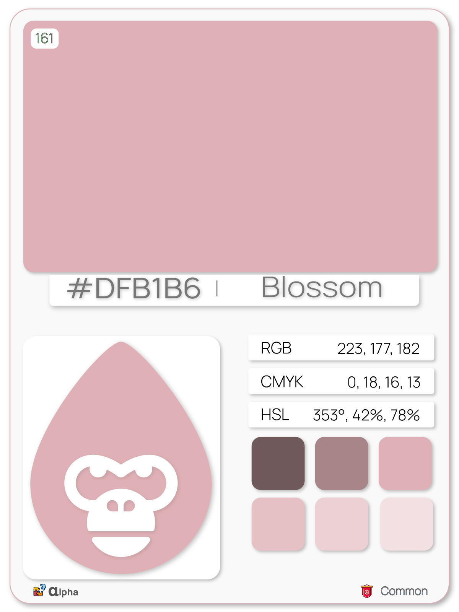<figcaption>
<a href="https://hopers.io/nft/detail?token_id=HexGorilla.161">#DFB1B6 - Blossom</a>
</figcaption></figure>

 

<figure>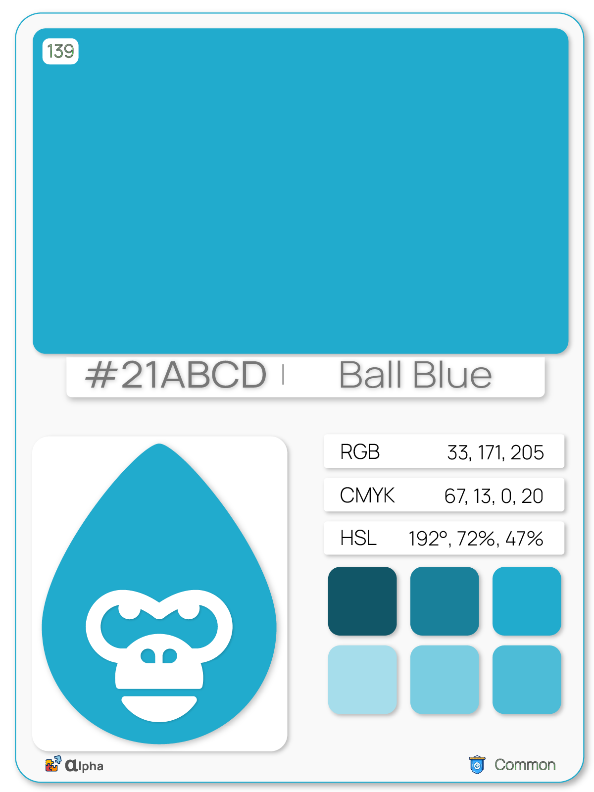<figcaption>
<a href="https://hopers.io/nft/detail?token_id=HexGorilla.139">#21ABCD - Ball Blue</a>
</figcaption></figure>

 

<figure>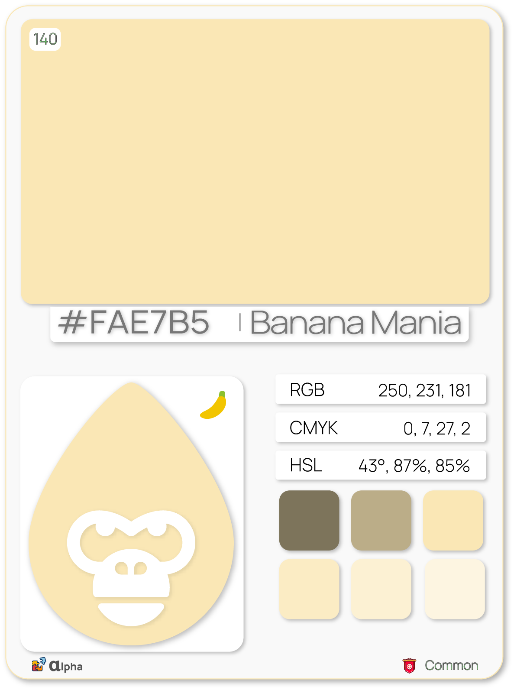<figcaption>
<a href="https://hopers.io/nft/detail?token_id=HexGorilla.140">#FAE7B5 - Banana Mania</a>
</figcaption></figure>

## Terra v2 

### [Talis Protocol](https://gorilla.tiny.us/AlphaTerra)

Our home away from home. Talis has always been close to our heart, and their mission aligns with ours. It was never a question whether we would drop a part of the collection on Talis, but we question how many. In the end, we settled on 500 would be dropped on Talis' newly raised [Juno network](https://talis.art/collection/62eb08907df4132b48498b47), and another 100 on [Terra v2](https://talis.art/collection/631d21281ff0ae398a3344e4). [Learn More](https://talis.art/user/62491ad56764046a3e422fa4)

<figure>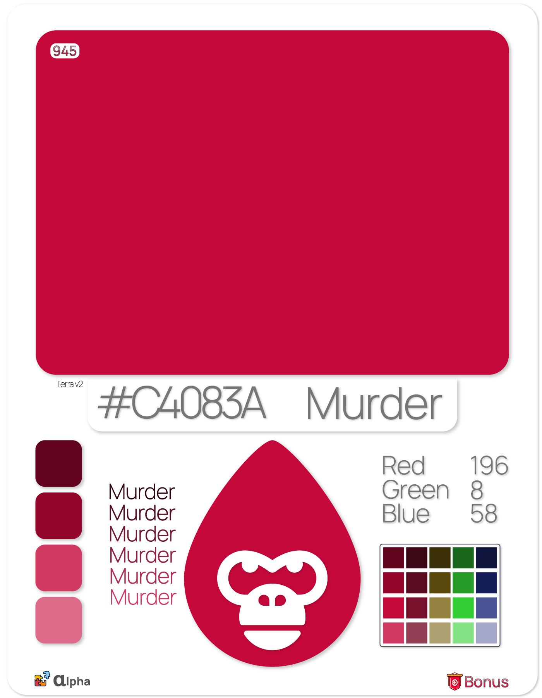<figcaption>
<a href="https://talis.art/token/63351fd6dda6d1d19bdd38b6">#C4083A - Murder</a>
</figcaption></figure>

 

<figure>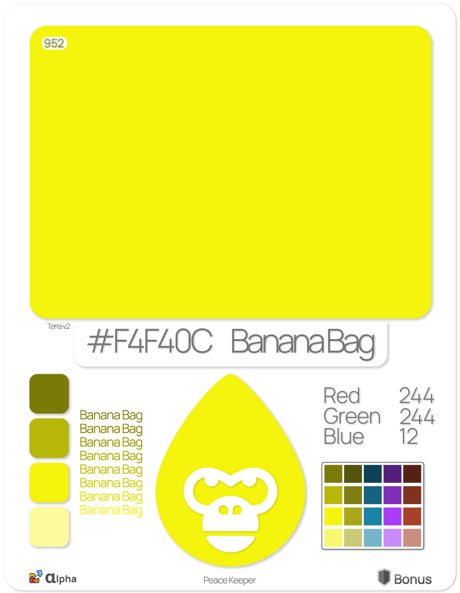<figcaption>
<a href="https://talis.art/token/63364fbe248087c51c95020d">#F4F40C - Banana bag</a>
</figcaption></figure>

## Irisnet 

### [UpTick NFT](https://gorilla.tiny.us/UpTickNFT) 

Up Tick NFT marketplace is a unique and diverse space where you can see the best of what NFTs can offer. On both the Irisnet and Cosmos, Up Tick is home to 50 of our 'Alpha' collection, and the center point for some of our more ambitious projects. [Learn More](https://web.upticknft.com/#/otherpage?did=iaa13ne2ssyt4pzpq0qvmddzsxtnh5duu6vj6x3gg6)

<figure>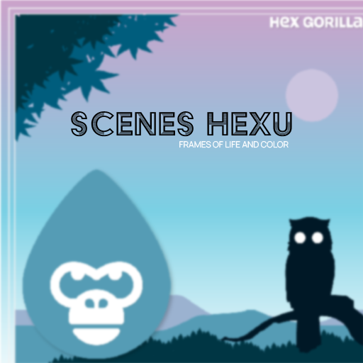<figcaption>
<a href="https://www.upticknft.com/collection/scenes">Scenes Hexu - Frames of Life and Color</a>
</figcaption></figure>

 

<figure><figcaption>
<a href="https://www.upticknft.com/collection/hexgorillalegacy">Hex Gorilla 'Legacy'</a>
</figcaption></figure>

## Secret Network 

### [Stashh](https://gorilla.tiny.us/stashh) 

The place where privacy takes on a new meaning, Stashh is an interesting dynamic indeed. Currently housing our, "[Hex Gorilla Heroes](https://stashh.io/collection/hex-gorilla-heros)" collection, 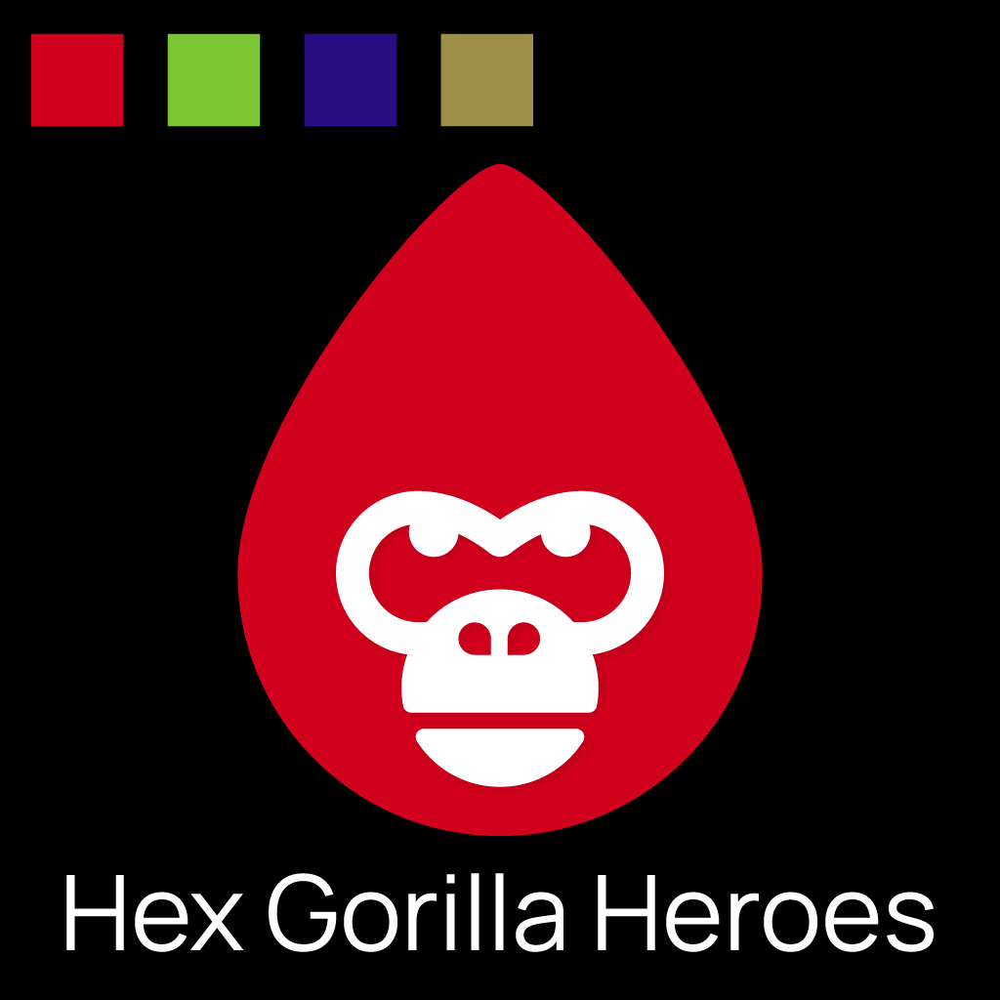 we can see some big things coming out of this partnership in the future. With badges, reveals, and yes.. privacy, there are countless possibilities. [Learn More](https://stashh.io/collection/hex-gorilla-heros)

<figure>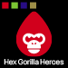<figcaption>
<a href="https://stashh.io/collection/hex-gorilla-heros">Hex Gorilla Heroes</a>
</figcaption></figure>

## Loopring 

### [UpTick on Loopring](https://gorilla.tiny.us/loopring) 

With our success on Up Tick Irisnet, we expanded and took the invite to create a collection on their newest expansion towards Loopring. Although this chain is getting it's feet under it, we see that the possibilities for Loopring are endless and look forward to seeing some amazing projects there. [Learn More](https://loopring.upticknft.com/otherpage?did=0xf0609a90149ab5982e3070bd553fc88684dea820)

We have four exclusive NFTs from our Hex Gorilla Kings collection on the platform now.

<figure>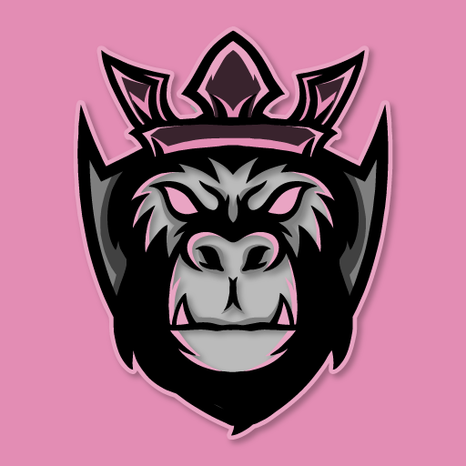<figcaption>
<a href="https://loopring.upticknft.com/carddetail?from=my&#x26;tokenAddress=0xe5dc592eb3814d566cf6430fe5cb2d284cc0709a&#x26;nftId=0xb80c8fb60649bf4ef8909f423eddc5856c8e2ed90c1291d221b084a4c9d2f042&#x26;assetId=1283065&#x26;owner=0xb80c8fb60649bf4ef8909f423eddc5856c8e2ed90c1291d221b084a4c9d2f042">Hex Gorilla King Pink</a>
</figcaption></figure>

 

<figure>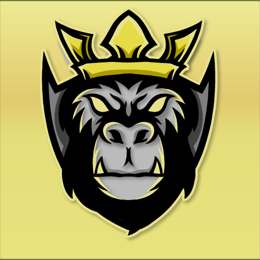<figcaption>
<a href="https://loopring.upticknft.com/carddetail?from=my&#x26;tokenAddress=0xE5dc592EB3814D566cf6430fE5cB2d284cc0709a&#x26;nftId=0x6e17f2a0265ce5ebbcfb62720aa987711f8a55f39e87b796bafc2b5ab70e79b7&#x26;assetId=1276138&#x26;owner=0x6e17f2a0265ce5ebbcfb62720aa987711f8a55f39e87b796bafc2b5ab70e79b7">Hex Gorilla King Gold</a>
</figcaption></figure>

 

<figure><figcaption>
<a href="https://loopring.upticknft.com/carddetail?from=my&#x26;tokenAddress=0xE5dc592EB3814D566cf6430fE5cB2d284cc0709a&#x26;nftId=0x799d44fdfb2e8996c5933259cbec823d004d6fbf2653cbc1bc3750cd389d0bc0&#x26;assetId=1276318&#x26;owner=0x799d44fdfb2e8996c5933259cbec823d004d6fbf2653cbc1bc3750cd389d0bc0">Hex Gorilla King Green</a>
</figcaption></figure>

 

<figure><figcaption>
<a href="https://loopring.upticknft.com/carddetail?from=my&#x26;tokenAddress=0xE5dc592EB3814D566cf6430fE5cB2d284cc0709a&#x26;nftId=0x7db2badb076bea1fddfb4b5ded765678178bab48ea644b16c7f5ce63d900f4ee&#x26;assetId=1276139&#x26;owner=0x7db2badb076bea1fddfb4b5ded765678178bab48ea644b16c7f5ce63d900f4ee">Hex Gorilla King Blue</a>
</figcaption></figure>

## Tezos &#x20;

Tezos offers a deep and rich experience when it comes to web3 integration and simplicity. With several well establish and low transaction fee marketplaces, we had to drop a few things on this legacy chain. The uniqueness and diversity we added to the collection is amazing.&#x20;

### [FX Hash](https://gorilla.tiny.us/Hex-Munchies) 

Set up as the easiest "generative" art creation platform, FX Hash is home to our most unique and reality stretched collections, [Hex Gorilla Munchies](https://www.fxhash.xyz/generative/18825). With just 100 pieces, and a free mint, we love how this project turned out. [Learn More](https://www.fxhash.xyz/generative/18825)

<figure><figcaption>
<a href="https://www.fxhash.xyz/gentk/1131125">Hex Gorilla Munchies</a>
</figcaption></figure>

 

<figure><figcaption>
<a href="https://www.fxhash.xyz/gentk/1131147">Hex Gorilla Munchies</a>
</figcaption></figure>

 

<figure><figcaption>
<a href="https://www.fxhash.xyz/gentk/1152658">Hex Gorilla Munchies</a>
</figcaption></figure>

### [Objkt.com](https://gorilla.tiny.us/Objekt) 

One of the largest marketplaces on Tezos, we have a limited edition and one of a kind piece on the platform as of now, and intend to put much more up in the future. [Learn More](https://objkt.com/asset/hicetnunc/774554)

<figure>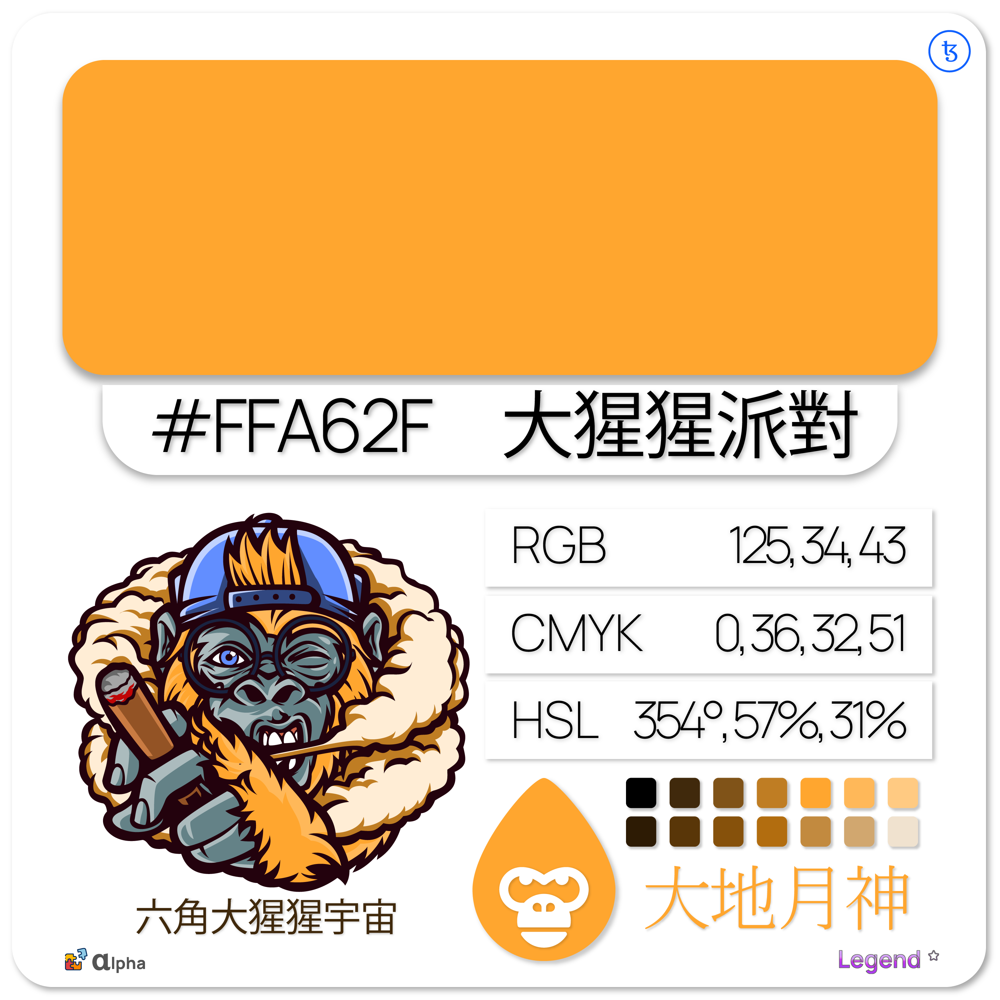<figcaption>
<a href="https://objkt.com/asset/hicetnunc/774554">Hex Gorilla Universe</a>
</figcaption></figure>

## Other

Also found on:

<figure><figcaption></figcaption></figure>

 

<figure><figcaption></figcaption></figure>

 

<figure><figcaption></figcaption></figure>

 

<figure><figcaption></figcaption></figure>

 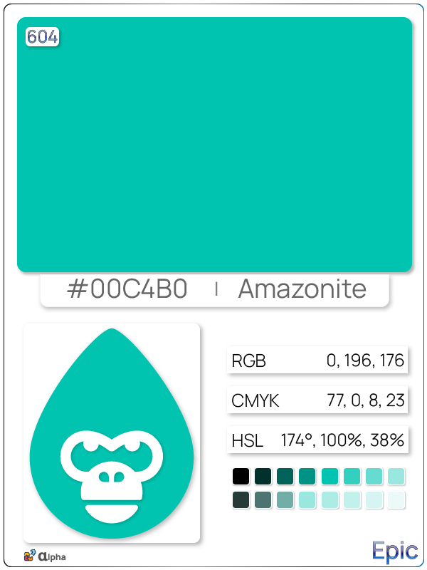 

### Hex Gorilla Universe

The Hex Gorilla Universe is a multi-chain, collaborative art and NFT collection that focuses on the use and appreciation of a diverse spectrum of colors that enrich our lives. Within these colors lies the crucial coding we need for all of our creations. From predicting and calculating personality traits for our Universe inhabitants, to the random generation of our characters and NPCs, color plays a crucial role in everything we are about.
