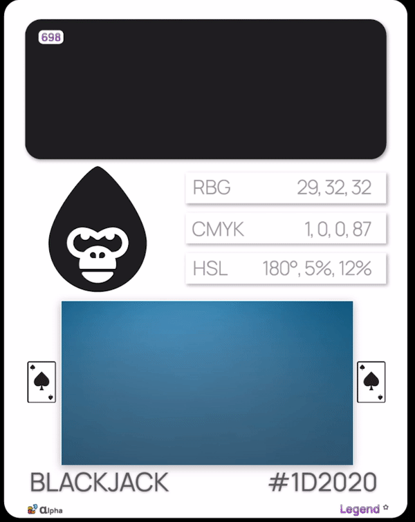

# 🌤 Alpha

### Alpha Collection

Our most extensive collection, and the most innovative one to date dropped July 31st on [Hopers.io](https://hopers.io). The Alpha collection will take what we have learned from Genesis and shaped it into a finely tuned record of color and utility. With extra features and traits,  our collection sets itself  apart from the rest of the NFT community. The era of minting regurgitated and over-hyped PFPs is over. Whether the marketing is just so good on some of this so called, "Blue Chip NFTs," or we are living in opposite land, but I just don't understand the appeal anyone would have in spending their crypto on the same thing as they did before. We think differently, and think that every piece of our collections are unique. They can never be duplicated. Meanwhile there is literally a "Punk" collection on every chain. Carrying on...

  

### Alpha Dynamics

With Alpha, we took what we learned from [Genesis](../genesis.md) and significantly raised our own standards. Following that successful mint, we added "[Team Affiliation](./#the-teams)" to our core attributes, which had to be a significant part of our overall core components. Every color in existence has a <mark style="color:red;">red</mark>, <mark style="color:green;">green</mark>, and <mark style="color:blue;">blue</mark> blend to create the amazing spectrum of colors in the world around us. These <mark style="color:red;">**R**</mark><mark style="color:green;">**G**</mark><mark style="color:blue;">**B**</mark> intensity percentages, which can be greater or less, indicate the card's team affiliation.&#x20;

### The Teams

.png>) .png>) .png>)

The initial captains of Hex Gorilla were selected based on the [Genesis Collection](../genesis.md#the-collection) reward mechanics and our infamous "Duck Crawl," which selected 6 lucky legend holders with one-of-a-kind captain cards. This has led to the creation of three distinct [team affiliations](./#the-teams), each one representing their respective color group. After our release of the exclusive community only mint, "[Season One](side-missions/season-one.md)," we have since expanded these captain leadership cards to include an entire leader class coupled with our elite [Leadership Council](broken-reference), which helps govern our community and are voting board members of our community's [DAO](broken-reference).

   .png>)

### Mechanics

This is our most eclectic collection ever, with a vast volume of levels within the makeup. Many elements, while presented in a logical and intuitive structure, have been created with scalability and evolution in mind. This includes additional metadata components, an increase in the rarity of legitimate use cases, and even an encryption level that leads to new reward metrics and utility. With the introduction of additional rarity levels such as "Hex Community," "Bonus," and "Special," we have added incredible depth to our Alpha collection.

 .png>)  

### Rewards

Every new project contains flaws that must be ironed out, lessons learnt, and efficiently implemented the next time. HG is an innovative project, yet it, like any other in the sector, has shortcomings. We've learned a great deal over this process, and each subsequent step must be better than the one before it. Having said that, it is often essential to acknowledge your community for their patience, energy, and steadfast commitment during this process.

<figure><figcaption>
<a href="side-missions/gorilla-haus.md">Gorilla Haus v1</a>
</figcaption></figure>

 

<figure><figcaption>
<a href="side-missions/gorilla-haus.md">Gorilla Haus v1</a>
</figcaption></figure>

 

<figure><figcaption>
<a href="side-missions/gorilla-haus.md">Gorilla Haus v1</a>
</figcaption></figure>

We are always thinking about and discovering new ways to encourage engagement and give our community a genuine sense of ownership in our organization. Our [HEXU DAO](broken-reference) has been critical in allowing our members to vote on the trajectory of our organization. One of the most significant ideas recently adopted was a profit-sharing model in which royalties and an initial portion of the minting costs are deposited into our treasury. In a forthcoming proposal, we will vote on how this income will be distributed. Ideally, when we have completely minted our Alpha collection entirely.&#x20;

### Hopers Launch

The initial whitelist was set to be a free mint for our most engaged community leaders. Unfortunately, the mechanics were not there to offer such a mint, and the initial community mints were met with a "failed" reply. After recognizing and fixing the issue, we were met with a 0.1 Juno price for the whitelist mint. My initial thoughts were to just refund the community members the mint price, but we were outvoted by the community, who said that they wanted the price to go into the treasury for the community. That has been completed.

  

### Talis Launch

The Talis Protocol launch and specifically the whitelist, unfortunately, can not be free either, or even at a reduced cost. This will be an exclusive VIP sale where whitelisted Gorilla VIPs will be allowed to mint 3 HG before anyone else. I have decided that every whitelisted community member that mints during this period will receive (1) an Epic HG and (2) be entered into a drawing where 25% of the proceeds made during the whitelist phase will be rewarded to some lucky gorilla!

#### <mark style="color:purple;">LEGENDS</mark>

  

#### <mark style="color:blue;">EPICS</mark>

.png>) 
