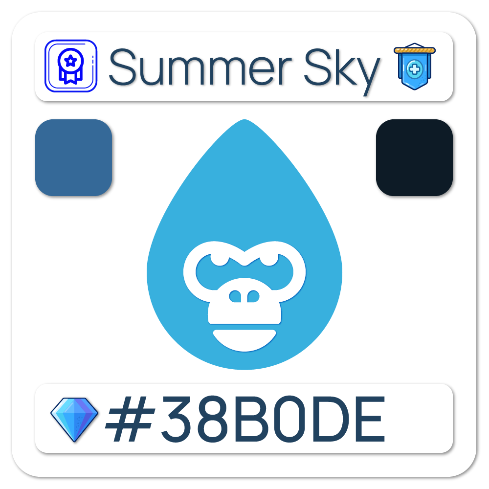

# 🙃 Side Missions

While the main narrative of any game is usually the most important component, side missions may be just as interesting and rewarding. From gorgeously colored faces to true encryption, entrepreneurs and artists may accomplish a lot by generating diversions that allow the whole idea to inspire its own depth. In this post, we'll take a look at some of the best video game side missions and explain why they're so great.

### [Season One](season-one.md)

#### The Leadership

At the completion of our [Genesis](../../genesis.md) collection minting, <mark style="color:blue;">**Captains**</mark> were created as a leadership framework for our future ambitions and began as a reward component.

<figure><figcaption></figcaption></figure>

 

<figure><figcaption></figcaption></figure>

 

<figure><figcaption></figcaption></figure>

### [Gorilla Haus](gorilla-haus.md) [v1](./#season-one)

#### Introducing the Basics

As Terra v2 began to rebuild, we had the opportunity to consider where we might relocate our project. We genuinely love the Terra Community and hold the [Talis Protocol](https://terra.art) team in high regard. We were working on a PFP project that would align with our community's pride in displaying their love for HG, and we introduced <mark style="color:purple;">**Gorilla Haus**</mark> in response to that passion, becoming the second new collection to mint a project on the new Terra v2 with [Talis Protocol](https://talis.art).

<figure><figcaption></figcaption></figure>

 

<figure><figcaption></figcaption></figure>

 

<figure><figcaption></figcaption></figure>

 

<figure><figcaption></figcaption></figure>

### [Gorilla Haus v2](./#gorilla-haus-v2)

#### Extension of Knowledge

The second edition in our "Gorilla Haus" side quest, was introduced to the Talis Community on the Juno Network blockchain.

<figure><figcaption>
<a href="./#gorilla-haus-v2">Gorilla Haus v2 </a>
</figcaption></figure>

