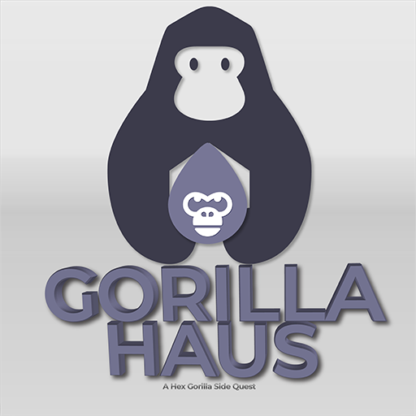
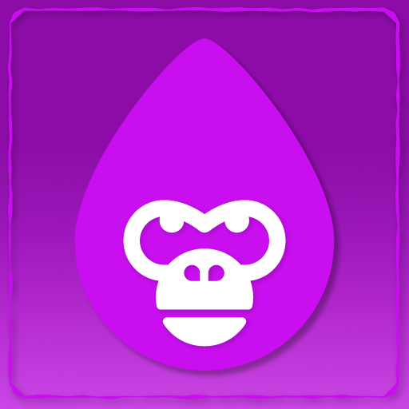

# 🦍 Gorilla Haus

As Terra v2 began to rebuild, we had the opportunity to consider where we might relocate our project. We genuinely love the Terra Community and hold the [Talis Protocol](https://terra.art) team in high regard. We were working on a PFP project that would align with our community's pride in displaying their love for HG, and we introduced <mark style="color:purple;">**Gorilla Haus**</mark> in response to that passion, becoming the second new collection to mint a project on the new Terra v2 with [Talis Protocol](https://talis.art).

.png>)  (2).png>)  (1).png>) .png>)

The unique design has come with several additional aspects to minting this one-of-a-kind collection. Each <mark style="color:purple;">**Gorilla Haus**</mark> is unique, just like any of our other collections. We make a point of taking the term "non-fungible" to another level. When you have any of our creations, you can be confident that you are the only one who has that unique color and Gorilla.



.png>) 

We have enlarged the inclusion of <mark style="color:purple;">**Gorilla Haus**</mark> holders to include them as full members of the community, with all of the advantages and perks that come with our [Genesis collection](../../genesis.md). If you already have one or buy one on the secondary market, you are eligible to not only become a board member in our [DAO](broken-reference), but also to join our [Leadership Council](broken-reference). This limited group enjoys additional perks and is regarded as community mentors. They are also eligible for our profit sharing mechanisms, and their names are on the list for all current and future collections.

### Gorilla Haus v2
