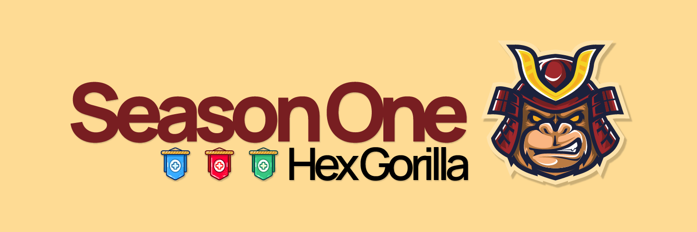
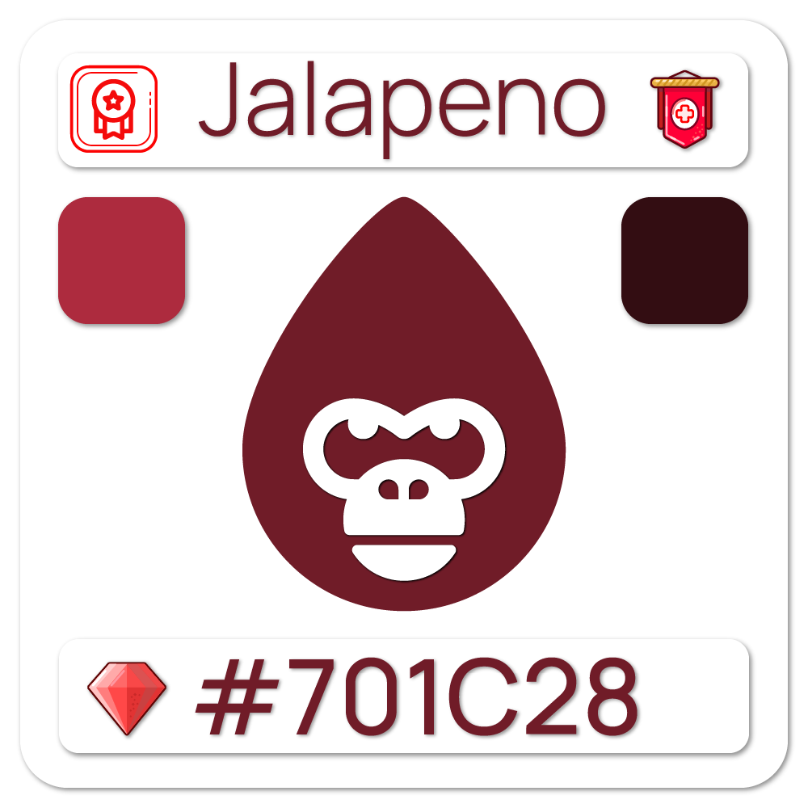
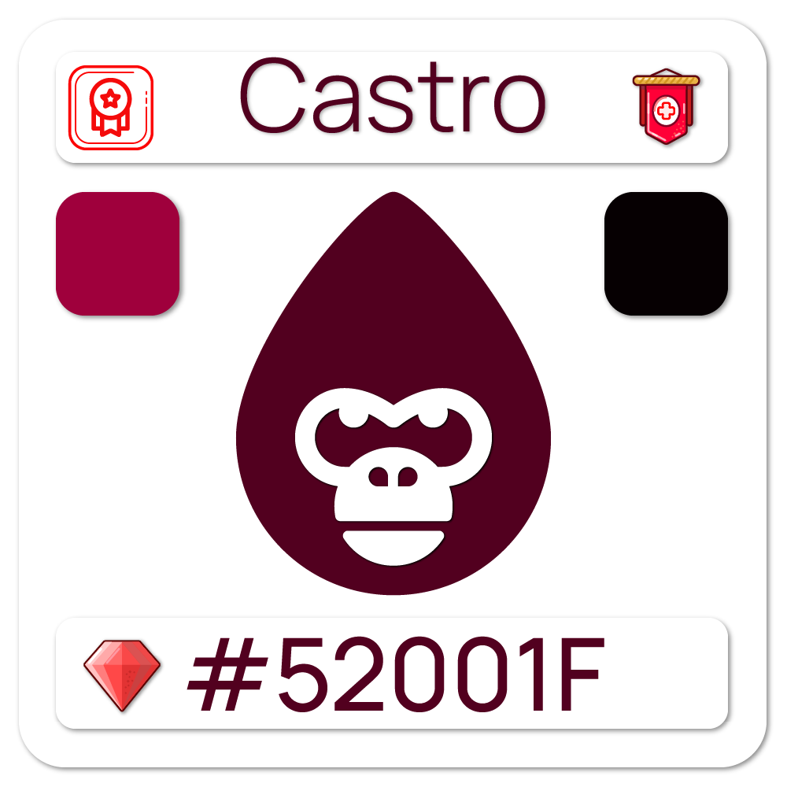
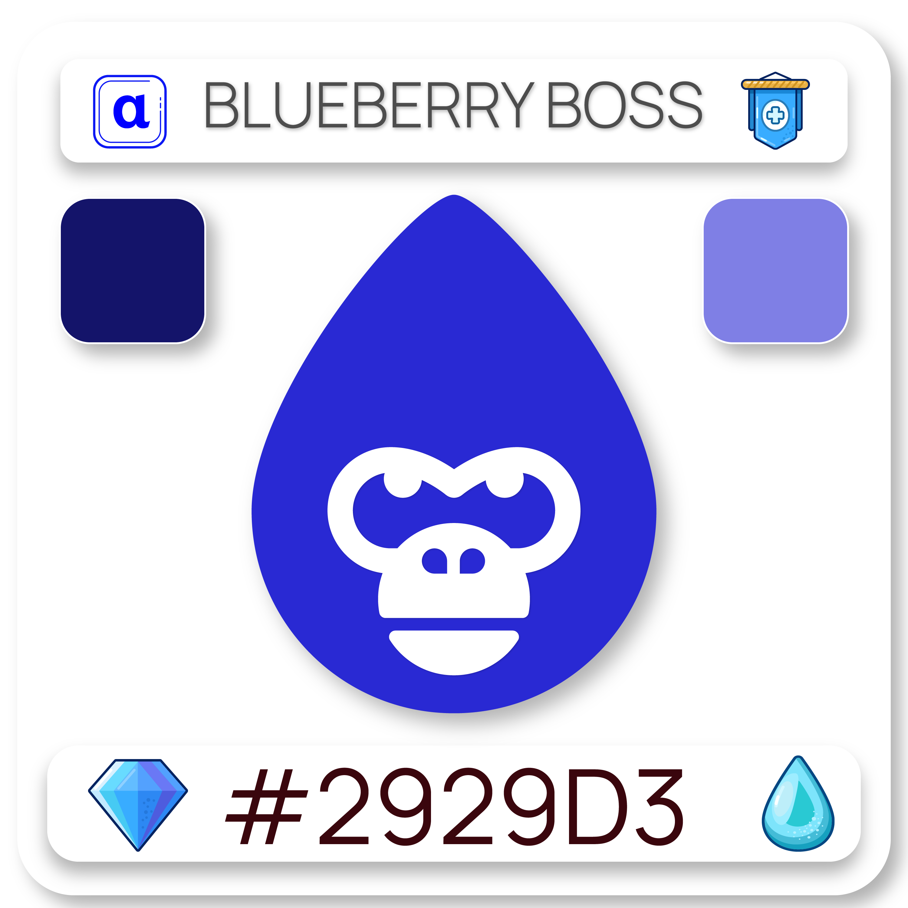
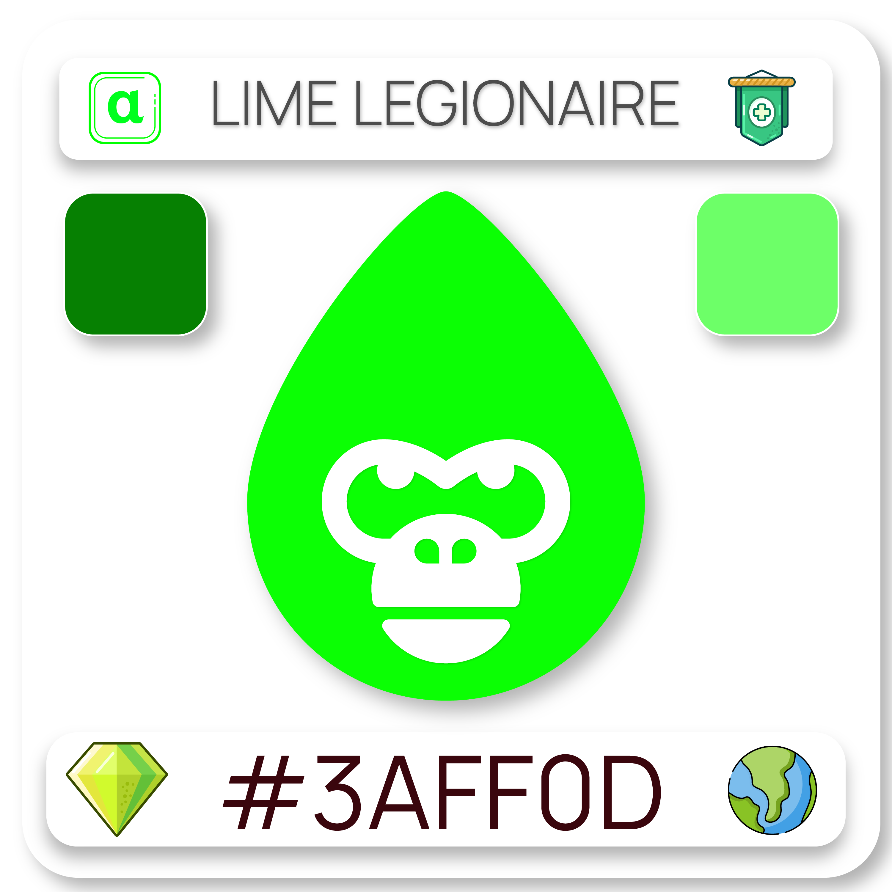
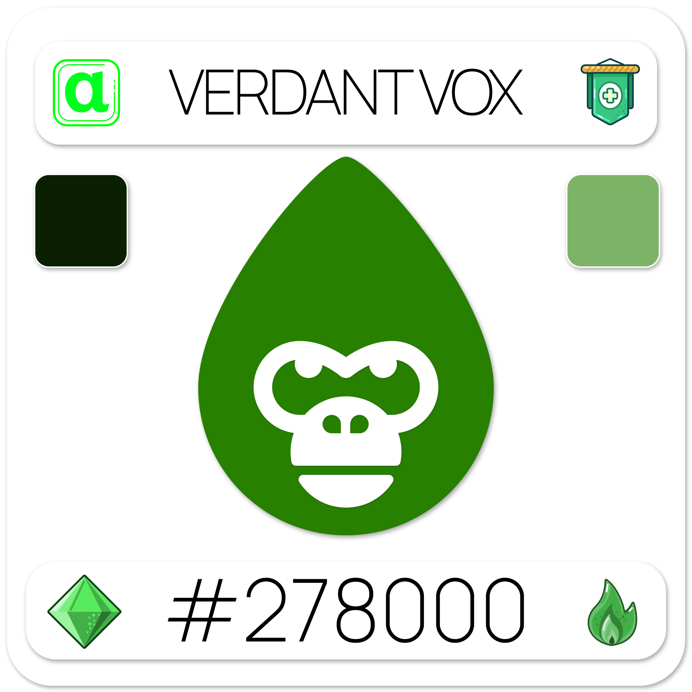
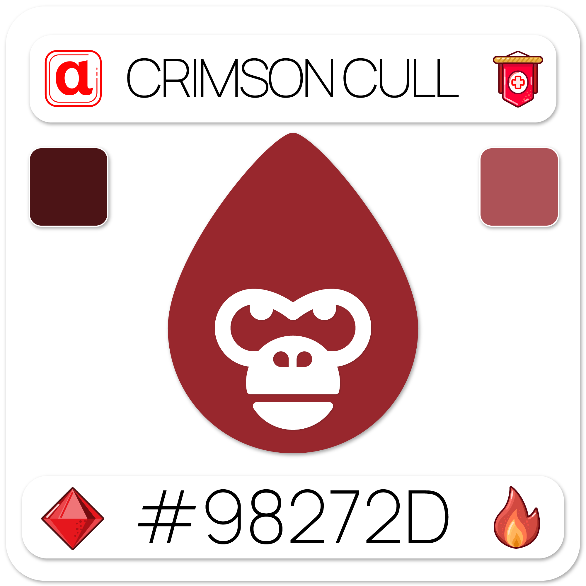

# 🥈 Season One

### [Captains](season-one.md#captains)

At the completion of our [Genesis](../../genesis.md) collection minting, <mark style="color:blue;">**Captains**</mark> were created as a leadership framework for our future ambitions and began as a reward component. With the introduction of Team Affiliation, the Captain class has received a considerable boost in terms of responsibility for the community's direction.

.png>)  .png>)  .png>) .png>)

### [Lieutenants](season-one.md#lieutenants)

There are numerous levels of leadership within our organization, just as there are in any other, and as your organization grows, the need for more specialized leaders grows. We created our <mark style="color:blue;">**lieutenant**</mark> class to encourage more community involvement and to build a hierarchy in our overall leadership model. This announcement corresponded with the creation of our DAO, and community members who possessed leadership tokens (captains, lieutenants, and generals) were automatically assigned to our Leadership Council.

.png>)   .png>)

### [Generals](season-one.md#generals)

Our generals govern over the highest echelons of society and the destiny of Hex Gorilla. Generals can command armies and even intervene within the political structures of the communities they represent. <mark style="color:blue;">**Generals**</mark>, like all other leadership classes, can participate in our leadership council and DAO, but unlike the lower classes, Generals will adapt and grow as additional variables are added to not only our NFT collections, but also to our future tokenomic and gamified platforms and ecosystems.

 .png>) 

### [Peace Keeper](season-one.md#peace-keeper)

The <mark style="color:blue;">**Peace Keepers**</mark> are the rarest leaders within [Season One](season-one.md). They are the neutrals or "United Nations" of the Hex Gorilla Universe. While carrying all the privileges and benefits of the Leadership Council and providing another level of depth to our current and future gamification strategy, this unique class has RGB values that keep it from fitting securely within any of the other three team affiliations. When a <mark style="color:red;">red</mark>, <mark style="color:blue;">blue</mark>, or <mark style="color:green;">green</mark> color variant of any card is equal to another opposite color and is higher than the remaining color of the three, they gain the <mark style="color:blue;">**Peace Keeper**</mark> role. They have additional capabilities that will be more apparent once we are able to reach our "[Release](broken-reference)" stage.

.png>) .png>) .png>)
