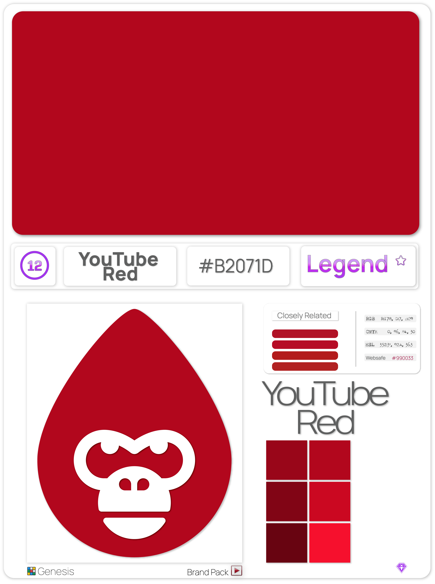

# ⛅ Genesis

### The Collection

Our [Genesis collection](genesis.md#the-collection) is made up of [100 unique hex color codes](genesis.md#the-collection) and their universally recognized names. The unique nature of color, and how they get their names, has always been a fascinating subject for our team. More than the use of color, the absence of color is something we find incredibly intriguing.

 

"[Absolute Zero](https://color-register.org/color/0048BA)" is our favorite example. Aside from the color itself, the best thing about this hue is how it earned its name. Scientists say that among all the blue colors and tints that may be created, this is the blue that physically represents the scientific [absolute zero](https://www.bing.com/ck/a?!&\&p=0a232be8d8e343aaJmltdHM9MTY1ODk1NTk1MyZpZ3VpZD1jYjA3MTA5Mi0zMzgyLTQzMDEtODQzNy1iMzVmNjNjNGFkYjImaW5zaWQ9NTE4Mg\&ptn=3\&hsh=3\&fclid=e6051ea0-0def-11ed-be8a-2c39f344b5e1\&u=a1aHR0cHM6Ly9lbi53aWtpcGVkaWEub3JnL3dpa2kvQWJzb2x1dGVfemVybw\&ntb=1).

### The Science of Color

The most intriguing aspect of using hexadecimal color codes to highlight our project, is there are over 16 million combinations that solicit emotion, memories, or any number of real reactions. In Hex Gorilla Genesis we worked closely with [The Official Registry of Color](https://color-register.org/) and the [International Color Consortium](https://color.org) to curate a collection of colors that we feel have a particular significance.

.png>)   

After taking the advice of Dr. Phil Green of the ICC, we started our research using the "[Common Crawl](https://www.bing.com/ck/a?!&\&p=8f6b5913d211ec6bJmltdHM9MTY1ODk1Njc4NyZpZ3VpZD1kMzI1M2JiOC03ZDYyLTQ4NzMtYTMyNi05ZDRlZjZlODg3N2MmaW5zaWQ9NTQ1NA\&ptn=3\&hsh=3\&fclid=d72bfb1a-0df1-11ed-9892-0de984b409cf\&u=a1aHR0cDovL3d3dy5jb21tb25jcmF3bC5vcmcv\&ntb=1)," which is an internet archive dating back to 2008. By utilizing that extensive resource and collaborating with others from around the world, we honed our collection down to what we see as an eclectic collection of color that lets people know, in the simplest way, what we are all about.

<figure><figcaption></figcaption></figure>

 

<figure><figcaption></figcaption></figure>

 

<figure><figcaption></figcaption></figure>

 

<figure><figcaption></figcaption></figure>

 

<figure><figcaption></figcaption></figure>

After taking the advice of Dr. Phil Green of the ICC, we started our research using the "[Common Crawl](https://www.bing.com/ck/a?!&\&p=8f6b5913d211ec6bJmltdHM9MTY1ODk1Njc4NyZpZ3VpZD1kMzI1M2JiOC03ZDYyLTQ4NzMtYTMyNi05ZDRlZjZlODg3N2MmaW5zaWQ9NTQ1NA\&ptn=3\&hsh=3\&fclid=d72bfb1a-0df1-11ed-9892-0de984b409cf\&u=a1aHR0cDovL3d3dy5jb21tb25jcmF3bC5vcmcv\&ntb=1)," which is an internet archive dating back to 2008. By utilizing that extensive resource and collaborating with others from around the world, we honed our collection down to what we see as an eclectic collection of color that lets people know, in the simplest way, what we are all about.

<figure><figcaption></figcaption></figure>

 

<figure><figcaption></figcaption></figure>

 

<figure><figcaption></figcaption></figure>

 

<figure><figcaption></figcaption></figure>

Launching our collection on [Terra blockchain](https://terra.money) was an amazing experience. It was one of those things that reminded us of what the early crypto sphere looked like when we first began our journey in 2017. This was an amazing new ecosystem that somehow, in 18 months, had gone all the way up to 8th on the marketcap and TVL listing on [coinmarketcap.com](https://coinmarketcap.com).

Then, probably the most important part of the Terra experience was meeting and collaborating with the [Talis Protocol](https://talis.art) NFT marketplace. Meeting the team over there and connecting on a personal level brought so much to the experience. The support and attention that these superstars gave to the new Terra collection and to our team made an impression on us that will never leave.


#### **The ratio of "**<mark style="color:purple;">**Legends**</mark>**" to "**<mark style="color:blue;">**Epics**</mark>**" and "**<mark style="color:green;">**Commons**</mark>**" is almost 1/1🔥**


   .png>) .png>) .png>)

You can currently find Hex Gorilla Genesis on the secondary market with [Talis Protocol](https://talis.art). That being said, our project is one that is known for its users and community not buying to sell, but holding to commit. **You are a part owner in our organization if you have any HG in your possession.**

 .png>)   

The long road that we have gone down has led us to very interesting conclusions. NFTs are an amazing avenue to showcase your artwork and help entice a community, but the utility limitations continue to be the barrier holding back it's eventual success. That is why we have begun to see things differently. Do things differently, and make the impossible differently.

> <mark style="color:green;">“</mark><mark style="color:green;">**Color is a power which directly influences the soul.”**</mark> <mark style="color:green;">**- Wassily Kandinsky**</mark>


Source: [Twitter](https://twitter.com/HexGorilla/status/1522248686851563520?s=20\&t=-DMwVtSZ0Q9amxQJkl8Icw)


#### <mark style="color:red;">**With Genesis complete, and all original minters holding, I can guarantee this is will be something that a lot of people will FOMO. Genesis has passed, but Hex Gorilla Universe continues on!**</mark>
