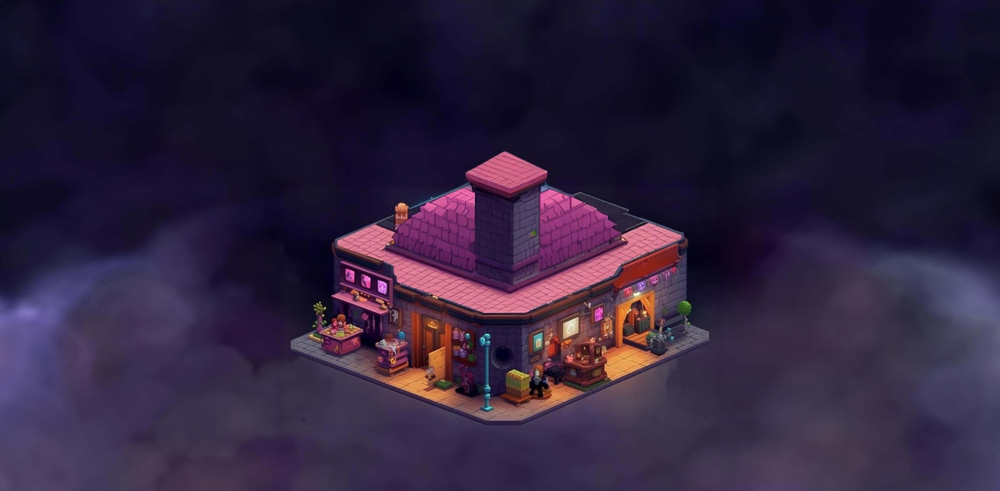

# 💹 Marketplace

<figure><figcaption></figcaption></figure>

The Hex Pixel Marketplace is a central hub for players to trade, purchase, and sell in-game items and assets. This includes unique player characters, weapons, armor, and other items that can be used to enhance gameplay. The marketplace is built on blockchain technology, which allows for true ownership of all items and assets and ensures that trades and transactions are secure and transparent.

Players can use the in-game currency, "Pixel," to purchase items from the marketplace. Pixel can be earned through gameplay, completing adventures, and participating in PVP battles. The marketplace also allows players to trade items with one another, creating a player-driven economy within the game.

The marketplace is intended to be simple and easy to use, with a large choice of things available at various price ranges. There will be a range of rare, unique, and one-of-a-kind things available only through particular in-game events or through trading with other players.

Additionally, the marketplace will feature a DAO (Decentralized Autonomous Organization) and governance council to ensure fairness and proper management of the in-game economy. The council will be responsible for maintaining the balance of the in-game economy, preventing fraud and ensuring that the marketplace is a safe place for players to trade items.

The Hex Pixel marketplace is an important part of the game, allowing players to obtain valuable items, trade with one another, and improve their gameplay experience.
