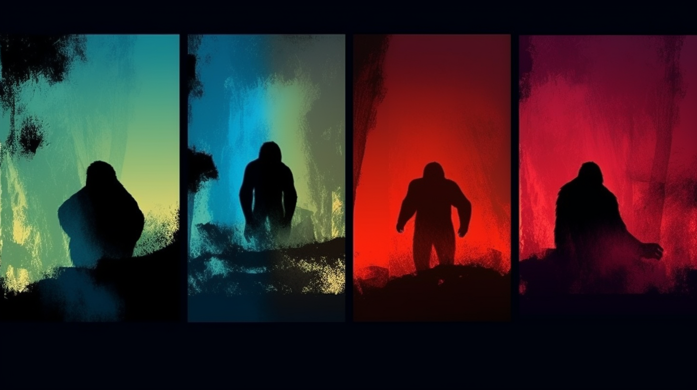
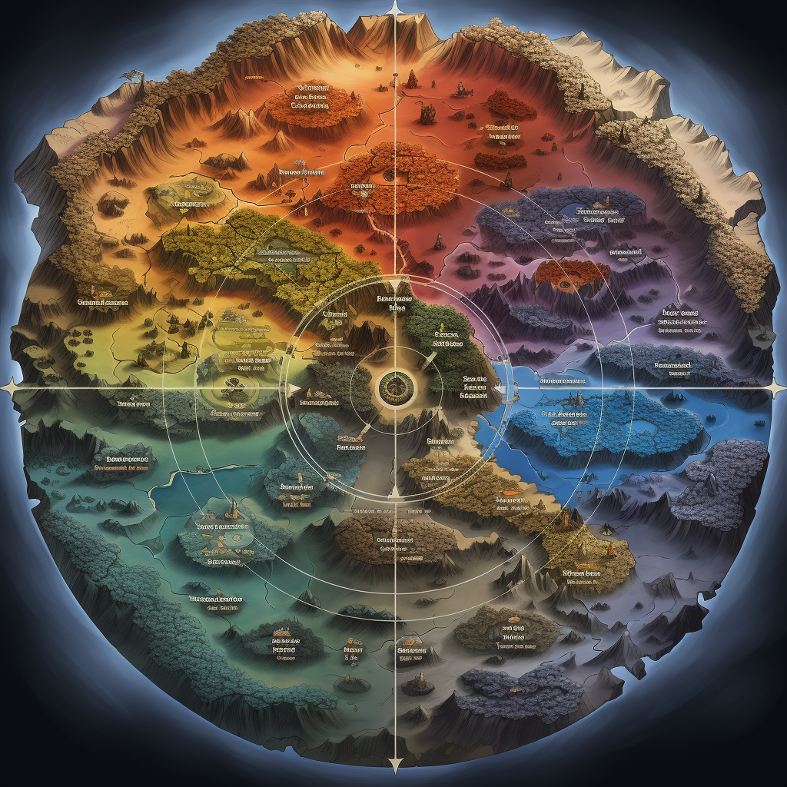

# 🕹 The Story

**A Journey into the Elemental Gorilla Kingdoms**

<figure><figcaption></figcaption></figure>

In a realm where fire danced, water whispered, earth stood strong, and air sang, four sages held dominion over the elemental forces. Ember, the Fire Sage, was a fiery spirit, her aura as brilliant and untamed as the solar flares she commanded. Wave, the Water Sage, was the master of the ocean's ebb and flow, his presence as soothing and mysterious as the deep blue sea. Stone, the Earth Sage, could make mountains bow and rocks tremble, his resilience echoing the enduring nature of the terrain he governed. Lastly, Wind, the Air Sage, danced with the breezes and commanded the storms, as free and unpredictable as the gusts in the upper echelons of the sky.

Together, they maintained the harmony of the Elemental Gorilla Kingdoms, a world painted in the vivid colors of their elemental dominion. Yet, this peace was shattered when the shadow of envy fell across their realm. An ominous figure, the sorcerer Vektra, poisoned with jealousy of the Sages' power, weaved a spell that tore through the fabric of elemental balance. Chaos ensued, turning the once serene kingdoms into a battlefield of clashing elements. The sages, forced to scatter, became elusive whispers in the winds of their respective domains.

Now, the Elemental Gorilla Kingdoms teeter on the brink of oblivion, threatened by Vektra's relentless forces. The hope for salvation lies with the four Sages, the elemental sentinels destined to restore balance. Scattered like stars across the vast world, they must reunite and weave together the threads of their fragmented powers.

These Gorilla Kingdoms were no mere stretches of land. They were living, breathing embodiments of their elements, brimming with lifeforms and landscapes unique to the essence they represented. But with the elemental balance perturbed, their future hangs in the balance, awaiting the return of harmony or the descent into chaos. The fate of the Elemental Gorilla Kingdoms hangs in the balance. Only the four Sages can save them.

<figure><figcaption></figcaption></figure>
