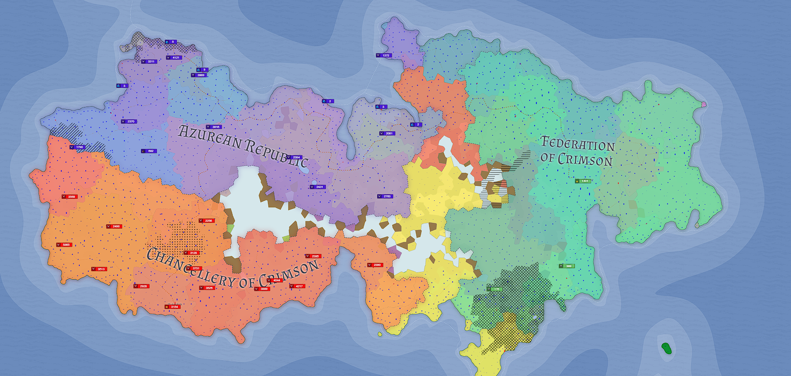

# 🌎 Exploring the World of Eldrida

<figure><figcaption>
Map Image: Edrida Cultural Map
</figcaption></figure>

Welcome to Eldrida, a planet brimming with distinct and unique locations for Hex Pixel players to explore. The globe of Eldrida offers a diverse range of settings for players to explore and conquer, from the expansive deserts of Duneclaw to the freezing tundra's of Frosthold. This guide will go over the various locations available in Hex Pixel, detailing the difficulty levels and backstories for each one.

Duneclaw: Located on Eldrida's western outskirts, Duneclaw is a large desert wasteland teeming with hazardous sandstorms and deadly monsters. The blistering heat and scarcity of supplies make this region one of the most difficult to navigate in the game. Brave explorers who withstand the hard conditions, on the other hand, will be rewarded with great prizes and rare resources.

Frosthold: On the other end of the scale, Frosthold is a frigid wasteland in Eldrida's northern reaches. This site is a test of endurance and survival because to the freezing weather and hazardous ice floes. Players must endure the cold and repel vicious monsters if they are to survive and capture the lucrative minerals hiding beneath the ice.

<figure><figcaption>
Map Image: Azurean Republic
</figcaption></figure>

The Ironwood: The Ironwood is a vast and ancient forest in the center of Eldrida, replete with tall trees and enigmatic creatures. Navigation is tough due to the dense greenery and winding passageways, but the riches buried there are well worth the effort. If players want to collect The Ironwood's bounties, they must be discreet and resourceful.

The Lost City: The relics of an ancient civilization lie deep in Eldrida's southern jungles. Because of the crumbling ruins and dangerous traps, this location is one of the most difficult in the game. The Lost City, on the other hand, hides valuable treasures and historical secrets for anyone willing to brave the hazards.

The Dark Caves: Beneath Eldrida's surface is a network of perilous caves and tunnels. The darkness and cramped quarters make navigating difficult, and the terrible monsters that inhabit this region make it a true test of strength and courage. The Dark Caves, however, provide lucrative minerals and unique treasures for those daring enough to descend into the depths.

Eldrida is a realm in Hex Pixel packed with different and hard locations for players to explore. Each locale, from the perilous dunes of Duneclaw to the frigid wastelands of Frosthold, presents its own set of difficulties and rewards. Players can better prepare for the adventures that await in the realm of Eldrida by studying the difficulty levels and backstories behind each location.
