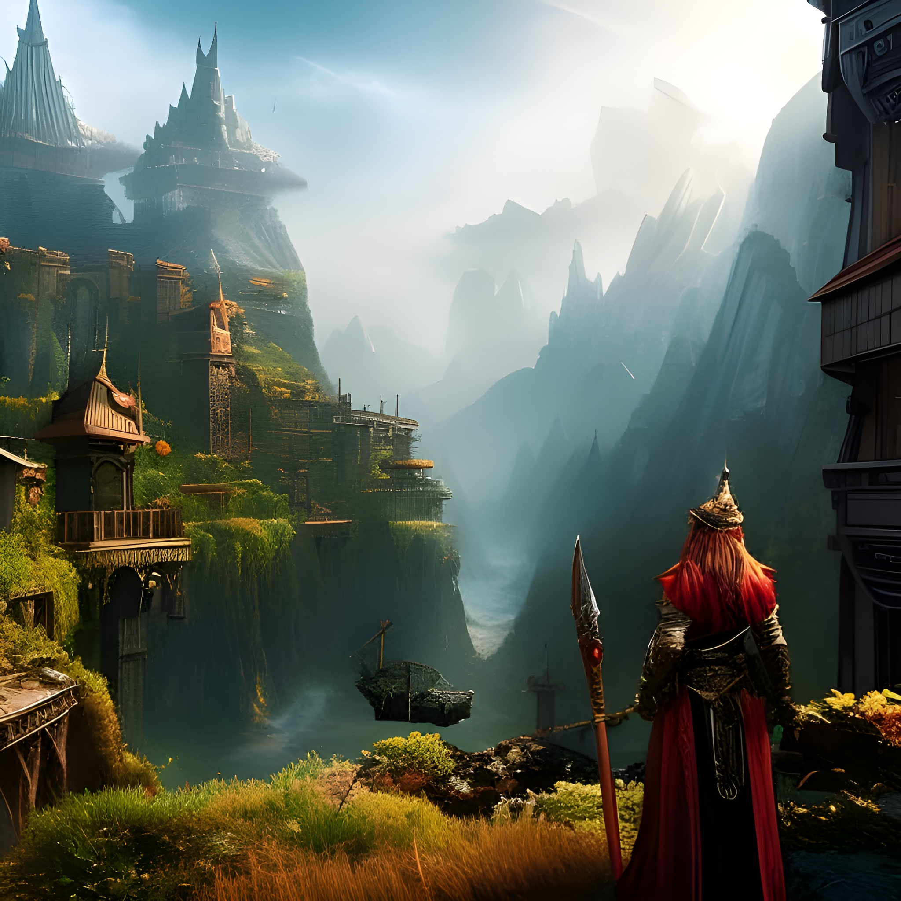

# 🏰 Battling for Glory

<figure><figcaption>
Source: <a href="https://creator.nightcafe.studio/creation/IuklpXK409o4IiYXux1t">Image</a>
</figcaption></figure>

Hex Pixel is a game that not only allows players to collect and breed unique digital creatures, but also to pit them against each other in exciting player versus player battles. Our PVP system is designed to provide a fair and enjoyable experience for all players, with a range of different battle modes and matchmaking options to suit different skill levels and playstyles.

At the core of the PVP system is the "Arena" mode, where players can challenge each other to one-on-one battles in real-time. Players will be able to select the creatures they wish to use in battle, and the game will automatically match them with an opponent of a similar skill level. The battles themselves will take place on a hexagonal grid, with players taking turns to move and attack with their creatures. Each creature will have a set of unique abilities and stats, and players will need to use strategy and skill to outmaneuver their opponents.

In addition to the Arena mode, we are also planning to include a "League" system, where players can compete in season-long tournaments to climb the ranks and earn rewards. The League will be divided into different tiers, with the top players in each tier earning special bonuses and recognition.

For players who prefer a more cooperative experience, we will also include a "Dungeon" mode, where groups of players can team up to take on challenging AI-controlled bosses and earn rare loot. The dungeon mode will offer a range of different difficulty levels, from casual to hardcore, to cater to different playstyles.

Ultimately, we intend to incorporate a "Battle Royale" mode in which players compete in a last-man-standing style competition on a diminishing map. This mode will be fast-paced and intense, requiring players to adapt swiftly to changing environments and outwit their opponents.

One of the key features of the PVP system is the matchmaking. The matchmaking algorithm will take into account a player's skill level and win-loss record, as well as the creatures they have chosen to use in battle, to ensure that matches are as fair and balanced as possible. We will also include a "practice" mode, where players can test their strategies against AI-controlled opponents before jumping into a real match.

The PVP system of Hex Pixel is designed to be both challenging and accessible, offering something for players of all skill levels and playstyles. Whether you're a hardcore competitor or just looking for a bit of friendly competition, there's something for everyone in the Hex Pixel PVP arena.
