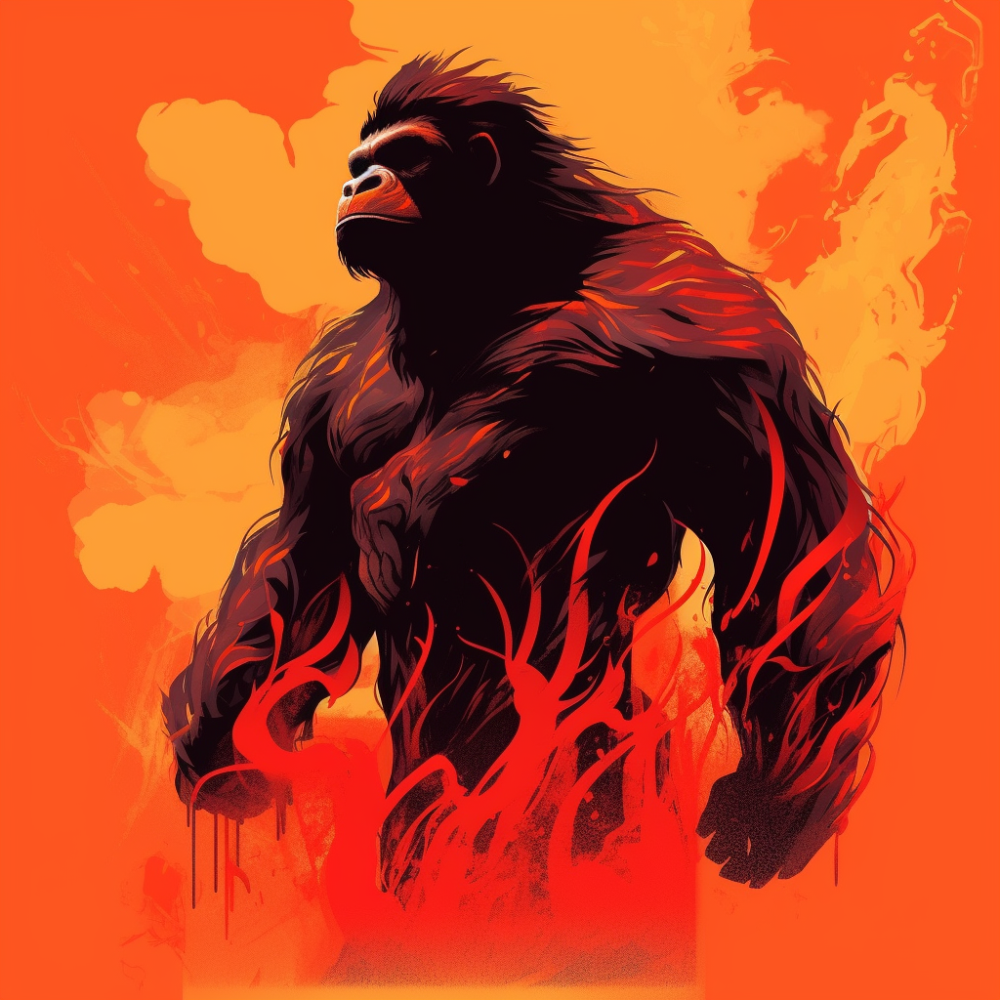

# NFT Character Evolution

<figure><figcaption></figcaption></figure>

In the compelling world of Hex Pixel, character development takes on a whole new dynamic with the elemental beings that dwell within. As you journey, you'll have the unique opportunity to unlock the true potential of these unique beings and harness their elemental powers to shape your destiny.

Within the Elemental Gorilla Kingdoms, each character represents a distinct elemental force. Whether it be the blazing infernos of Fire, the serene depths of Water, the steadfast power of Earth, or the exhilarating winds of Air. As you embark on your quest, you'll discover that your character's progression is deeply intertwined with your understanding and mastery of these elements.

<figure><figcaption></figcaption></figure>

 

<figure><figcaption></figcaption></figure>

 

<figure><figcaption></figcaption></figure>

 

<figure><figcaption></figcaption></figure>

As you advance through the game, you will be able to delve deeper into the mysteries of the Elementals. By earning experience points through various quests, challenges, and battles, you'll not only strengthen your characters, but also unlock the hidden depths of their elemental nature. As your characters grow, they will gain access to new elemental abilities, enabling them to summon flames, manipulate water, shape the earth, or soar through the skies.

Unlocking the full potential of your elemental characters requires a delicate balance between training and bonding with the elements. Engage in specialized training sessions to hone your characters' control over their elemental powers. Through immersive quests and encounters, you'll uncover ancient knowledge and secrets that will enable your characters to wield their element with greater finesse and raw power.

<figure><figcaption></figcaption></figure>

 

<figure><figcaption></figcaption></figure>

 

<figure><figcaption></figcaption></figure>

 

<figure><figcaption></figcaption></figure>

Equipping your elemental characters with elemental gear will enhance their connection to their respective elements. Discover legendary artifacts, enchanted trinkets, and element-infused armor that enhance their elemental abilities and give them unparalleled advantages in their elemental domain. Customize your characters' appearance with elemental-themed cosmetics, further cementing their bond with their chosen element.

As you make your way through the elemental realms, Hex Pixel will keep you updated on the accomplishments of your journey with in-game notifications. A treasure trove of unique elemental items, currencies, and exclusive bonuses commemorate your ascent through the elemental ranks on the dedicated rewards page.

<figure><figcaption></figcaption></figure>

 

<figure><figcaption></figcaption></figure>

 

<figure><figcaption></figcaption></figure>

