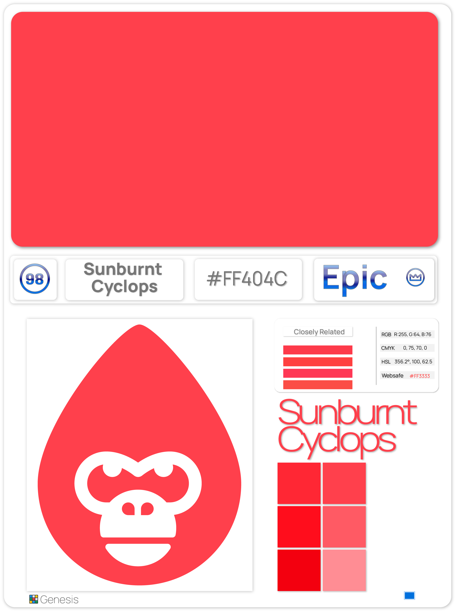

# Rarity System

<figure><figcaption>
Diverse and unique gaming environment
</figcaption></figure>

The rarity system intertwines with the elemental essence of NFT characters, bringing their unique traits and abilities to life in the fantastical world of Hex Pixel. As you delve deeper into the Elemental Realms, you'll discover the extraordinary connection between rarity, NFT evolution, and the captivating power of the elements.

Within the Elemental Realms, each NFT character possesses an inherent level of rarity, bestowed upon them by the mystical forces that govern their evolution. The generations of these characters dictate their uniqueness, with each successive generation unlocking new layers of power, prestige, and captivating abilities.

<figure><figcaption>
Color Breakdown
</figcaption></figure>

The rarity of NFT characters is not only a badge of honor, but a testament to their elemental power. Rare characters possess awe-inspiring abilities and exceptional attributes that transcend the mundane. From wielding devastating flames that consume enemies to summoning colossal waves that shape the very fabric of the water, these extraordinary characters command respect and admiration.

Understanding the rarity system is key to mastering the art of elemental evolution. As you journey through the elemental realms, you'll witness your characters grow and evolve, unlocking new levels of rarity and unlocking their hidden potential. With each advancement, your characters will transcend their previous limitations and reveal the true extent of their elemental power.

<figure><figcaption>
Example A
</figcaption></figure>

 

<figure><figcaption>
Example B
</figcaption></figure>

The interplay between rarity and NFT evolution offers a multitude of strategic possibilities. As you build your team of elemental characters, you'll carefully consider the balance between their elemental affinities and their rarity levels. Combining the unique abilities of rarer characters with the synergistic bonds of their elemental counterparts creates a force capable of meeting any challenge.

The rarity system within Hex Pixel fosters a vibrant ecosystem where the value of NFT characters transcends their elemental abilities. It paves the way for a dynamic marketplace where collectors, traders, and enthusiasts come together to celebrate the rarity and beauty of these remarkable creations. The lure of rarer characters ignites a fervor of exploration, trade, and competition as players seek to amass the most extraordinary and coveted NFTs.\

<figure><figcaption>
<mark style="color:purple;"><strong>Legend</strong></mark>
</figcaption></figure>

 

<figure><figcaption>
<mark style="color:blue;"><strong>Epic</strong></mark>
</figcaption></figure>

 

<figure><figcaption>
<mark style="color:green;"><strong>Common</strong></mark>
</figcaption></figure>

### Early Founder's Edition

As a special reward for those who join us in the early stages of the Hex Pixel adventure, we have an exclusive offer for [Genesis](../../hex-gorilla-collection/genesis.md) minters of our first [Hex Gorilla Alpha Collection](../../hex-gorilla-collection/alpha/). As a token of our appreciation, every Genesis minter will receive their very first power NFT for free. This power NFT holds immense potential, unlocking unique abilities and granting an advantage in the elemental realms. It's our way of honoring those who believe in the magic of Hex Pixel from the very beginning.&#x20;

<figure><figcaption></figcaption></figure>
