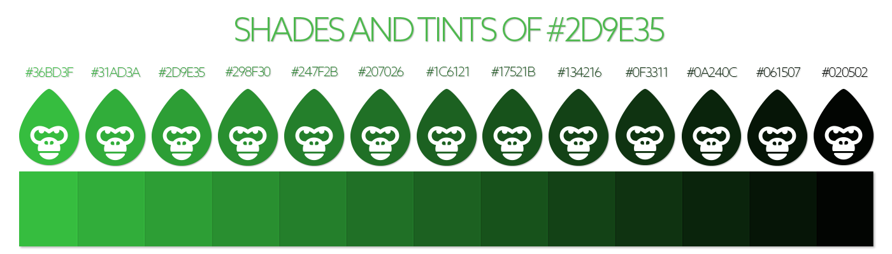
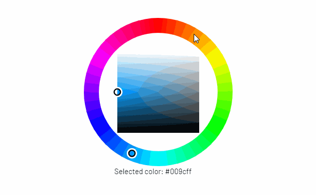

# 👨🎓 Learn

### Hexadecimal Codes

A hex color code is a 6-symbol code composed of three 2-symbol parts. Each of the two-symbol elements represents a color value ranging from 0 to 255.

The code is generated by a formula that converts each value into a unique 2-digit alphanumeric code. In hexadecimal format, the RGB code (200, 50, 72) is C83248. It's difficult and involves the base-16 numbering system. Here's a decent explanation if you're curious. If you're wondering what this all implies for you as a designer, here are a few key points to consider:\
▪️ You can display more than 16 million unique colors using hexadecimal coding, which is estimated to be more than the human eye can comprehend.\
▪️ You can use color pickers or converters to generate the code for you.



There are color pickers and converters available. Why is hex coding used rather of numbers? Because if you utilized numbers, every red, green, or blue value ranging from 0 to 255 may represent one, two, or three different digits. The code might consist of as little as three numbers or as much as nine digits. This may confuse not just the systems reading the codes, but also the individuals doing the coding. Having each value be six symbols, regardless of value, decreases the potential for errors when the code is generated on your behalf.

Hex color codes are a special code that represents color values from 0 to 255. If red, green, and blue are all at the minimum 0 (represented as "00" in the code), the color expressed is the color black. The hex color values can combine to show more than 16 million different colors. You always can use a converter to convert the RGB numeric values into hex code for you.&#x20;

### Why Hex Code?

_Because math._

Hex colors are based on the RGB color paradigm, which has been used in photography since its inception. By assigning different combinations of red, green, and blue to each eye, you may produce practically any color the eye can perceive. The entire number of potential color combinations is 16,777,216, which is more than the human eye can recognize.

Programmers favor hex color coding because they are predictable. They are always six digits, regardless of color. RGB values might be as little as three or as much as nine digits. It is not necessary to employ hex codes in web design. When coding a page in HTML, you may also utilize RGB values or even color names.

### Ok. Math. But why Gorillas?

_To put it very simply, breeding._

With over 16 million hex code (color) options available, we need a way to determine a "less than random" output from the breeding mechanics. Consider this: if you knew that just roughly 1600 truly rare hues existed among those 16 million, wouldn't you want to make sure you had the chance? What's amazing about our breeding technique is that I basically just handed you the cheat code. Of course, color, like any other design element, is subjective to the spectator. However, we did not go into this undertaking unprepared.&#x20;

### The Common Crawl

[The Common Crawl](https://commoncrawl.org/big-picture/what-we-do/) is a archive for the internet, but saying it like that is a bit underwhelming. It is literally a backup of the entire internet starting from 2008.  When I first learned about this database, I was in my senior year at Cal Poly, and my thesis topic was the rise and fall of technology. My professor directed me to the Common Crawl. I had everything I could ever want after figuring out how to gain its knowledge.

Using this internet archive we are able to research and identify some of the rarest hexadecimal colors that appear on the web. It has allowed us to get a very detailed interesting look into many of the trends we all just dismiss when we get done with whatever it is we are doing. For Hex Gorilla, it has added another level to what we want to accomplish.&#x20;
