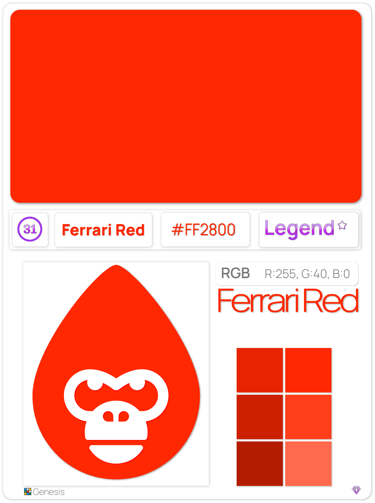

# 🟢 Hexadecimal

We came up with something unique when we unveiled our [Genesis collection](../../hex-gorilla/hex-gorilla-collection/genesis.md). 100 distinct [hexadecimal color codes](./#hexadecimal-codes) make up the collection, which was displayed in a special way by our very own gorilla. This is noteworthy because we undertook considerable research on the scarcity of colors that show on websites rather than simply picking 100 colors out of a box of Crayola crayons and starting to make drawings with them. We were interested in finding out which of the 16 million possible hex colors were the rarest because this is how many of us perceive color in a digital sense, i.e., on smartphones, monitors, and televisions.

.png>)  

In order to obtain insight into what we intended to achieve with this collection, we talked to experts in a number of different fields as a part of the process of bringing it all together. We uncovered something amazing while collaborating with Dr. Phil Green of the [International Color Consortium](https://color.org). Did you know there is an organization that has been completely archiving the internet since 2008? Neither did we, but that is exactly what we found. Known as the "Common Crawl," they provide a  copy of the internet and make it available to internet researchers, businesses, and individuals at free cost for the purpose of research and analysis by Common Crawl, a 501(c)(3) non-profit organization.
